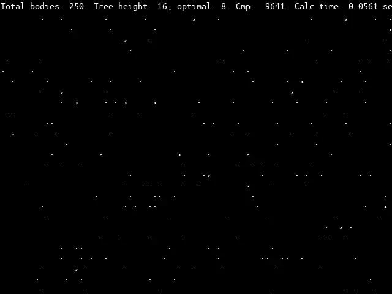
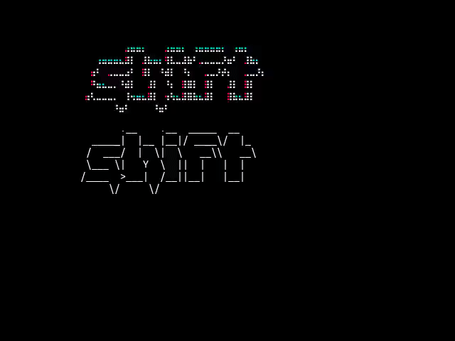
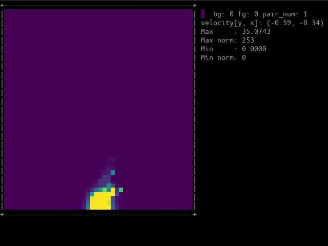

# textmode-playground
Playground for console (ASCII/Unicode) animations (intros). Where possible scripts should be self-sufficient.

## Requirements
Tested on GNOME Terminal (default DejaVu Sans Mono font) with braille font support.
- Python-fontconfig (0.5.1)  - Python bindings for Fontconfig library
- matplotlib
- scipy

## Gallery

  
  

