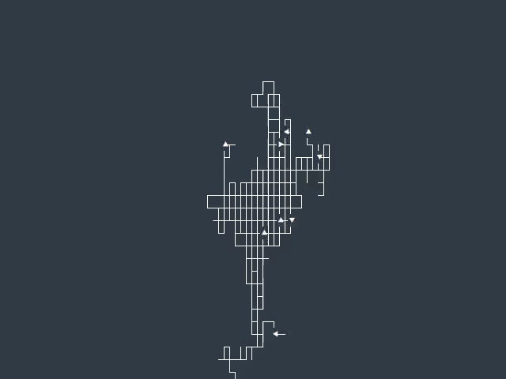

# textmode-playground
Playground for console (ASCII/Unicode) animations (intros).

## Requirements
Tested on GNOME Terminal (DejaVu Sans Mono font) with fonts fallback and 24-bits ("true color") [ANSI codes](https://en.wikipedia.org/wiki/ANSI_escape_code#24-bit) support.

For Python:
```bash
pip install -r requirements.txt
```

## Gallery

  
  
  

